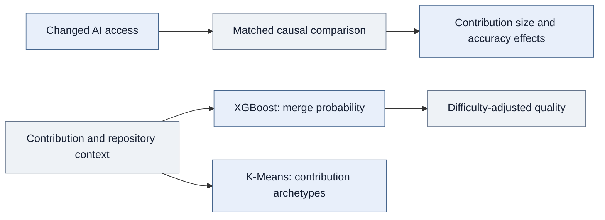

<div align="center">

# Are AI Users Producing More Work—or Better Work?

A quasi-experiment on AI's impact on contribution size and quality, supported by machine learning and behavioral segmentation.

**Quasi-experimentation · Causal inference · XGBoost · Difficulty-adjusted quality · K-Means**

[Overview](#project-overview) · [Experiment](#quasi-experimental-design) · [Impact](#impact-on-contribution-outcomes) · [ML](#machine-learning-for-quality-and-segmentation) · [Code](#explore-the-implementation)

</div>

## Project overview

**I used a quasi-experiment to estimate how an AI product affects the size and quality of user contributions, then examined differences across users. I used machine learning to account for acceptance context and characterize contribution patterns.**

Italy's temporary ChatGPT suspension created an external change in product access. I compared developer outcomes in Italy with outcomes in France and Portugal to estimate the response to lost access.

The central question is whether AI changes **how much users contribute and the quality of those contributions**. **XGBoost-based quality measurement** and **K-Means segmentation** complement the causal analysis by addressing contextual differences in acceptance and structural differences between contributions.

## Quasi-experimental design

| Design element | Implementation |
|---|---|
| Product and external event | ChatGPT's temporary access suspension in Italy |
| Treatment group | Developers in Italy |
| Comparison group | Developers in France and Portugal |
| Causal approach | Matched difference-in-differences |
| Contribution-size model | Poisson pseudo-maximum likelihood with developer and week effects and PR-count exposure |
| Outcomes | Contribution extent and accuracy-related outcomes |
| Heterogeneity | Differences by developer experience |

The treatment measures a change in country-level availability, not observed individual AI use. This was a naturally occurring access interruption, not a randomized rollout.

### Estimate contribution size conditional on contributing

I modeled total lines changed with pull-request count as exposure:

```text
E[total_lines_it | X] = PR_count_it × exp(
    developer_effect_i + week_effect_t + treatment_terms_it + controls_it
)
```

The log of positive PR count enters as an offset with coefficient fixed to one. This estimates changes in expected lines per pull request among developer-weeks with positive PR activity. It differs from ordinary least squares on a precomputed ratio and excludes zero-PR weeks from this specification.

## Impact on contribution outcomes

| Estimated response during lost access | Interpretation |
|---|---|
| **Approximately 48% fewer lines changed per pull request** | Contributions became smaller conditional on positive PR activity; the reported incidence-rate ratio is 0.522 |
| **Approximately 1.1% increase in the manuscript's accuracy measure** | A smaller movement, with marginal statistical significance at the 10% level |
| **Similar extent effects across experience groups** | The contribution-size response was not confined to one experience group |

The 48% estimate is not a decline in PR count or overall productivity. The smaller accuracy estimate does not prove that quality was unchanged. **Product impact differed across outcome dimensions:** a large movement in contribution size was accompanied by a much smaller movement in the accuracy-related measure.

## Machine learning for quality and segmentation

### **XGBoost: model acceptance in context**

**I developed an XGBoost merge-probability model using repository-, maintainer-, and contribution-level features. It achieved 0.82 AUC compared with 0.61 for a repository-level base-rate baseline.**

<table>
<tr><th align="left">XGBoost</th><th align="left">Repository baseline</th><th align="left">Structural segmentation</th></tr>
<tr><td><h2>0.82 AUC</h2>Merge-outcome discrimination</td><td><h2>0.61 AUC</h2>Repository-level base rate</td><td><h2>4 archetypes</h2>K-Means contribution groups</td></tr>
</table>

Merge outcomes depend on context as well as quality. The model captures differences in acceptance conditions instead of treating all repositories and contributions as interchangeable. AUC measures ranking performance; it is neither a classification-accuracy percentage nor a causal product effect.

### **Difficulty-adjusted quality: account for acceptance conditions**

**I used the predictive model to develop a difficulty-adjusted quality metric.** The purpose was to account for variation in acceptance difficulty when evaluating contributions, rather than directly comparing raw merge rates across contexts.

The proprietary adjustment formula is not distributed. The public sample's observed-minus-predicted residual is illustrative and is not claimed to have generated the manuscript's accuracy result. The predictive evaluation and the quasi-experimental accuracy estimate are distinct analytical outputs.

### **K-Means: identify contribution archetypes**

**I applied K-Means to structural pull-request features and identified four contribution archetypes.** This describes how contributions differ in form and complements the experience-based heterogeneity analysis. Clusters describe patterns; they do not themselves identify causal treatment effects.

The public sample demonstrates transformation, scaling, and clustering. Original feature settings and empirical cluster names are not reconstructed as facts.



<details>
<summary><strong>ML evaluation and representative-code scope</strong></summary>

The public example uses a training-only repository baseline and an explicitly supplied holdout. These are representative engineering choices, not claims about the original split design. Original hyperparameters, calibration results, and the exact adjustment formula are not supplied.

Strong discrimination alone does not establish calibration. Calibration would need to be assessed before interpreting probabilities operationally. Merge outcomes also reflect project fit and maintainer decisions, so the adjustment is not a direct correctness test.

</details>

## What the results tell a product team

The analysis distinguishes **effects on contribution size, effects on accuracy-related outcomes, and differences across users**. It shows why a product's impact on output should not automatically be interpreted as an equivalent impact on quality.

The ML work adds contextual measurement and a description of contribution types. It does not replace the quasi-experiment or turn predictive performance into evidence of product impact. Retention, revenue, automated acceptance decisions, and commercial deployment were outside this analysis.

## My contribution and interpretation boundaries

I led outcome definition, feature engineering, **XGBoost modeling and baseline evaluation**, **difficulty adjustment**, **K-Means segmentation**, causal estimation, and interpretation. The project uses the shared developer-activity infrastructure supporting the related studies.

The causal interpretation depends on the comparison group representing the counterfactual trend. Matching does not eliminate unobserved differential shocks. Results apply to this access interruption, and the contribution-size estimate is conditional on contributing. These distinctions matter when applying the findings to a different AI product or user population.

## Explore the implementation

> **Research status and code availability:** The research is currently under review. The full research code and data are proprietary and are not distributed here. The public code consists only of selected, simplified samples of the general workflow; it is not the complete research implementation or a replication package.

| Sample | What to inspect |
|---|---|
| [Quality model](quality_model.py) | Representative XGBoost workflow, holdout, and training-only baseline |
| [Contribution archetypes](contribution_archetypes.py) | Structural features, scaling, and four-cluster fitting |
| [Exposure specification](extent_model.py) | Total lines, PR exposure, and conditional sample |
| [Methodology](methodology.md) | Predictive evaluation, causal claims, and quality interpretation |

<details>
<summary><strong>Research source and sample scope</strong></summary>

This case study presents my contributions to collaborative doctoral research at UC Irvine, focused on quasi-experimental product impact analysis. The underlying study is *Generative AI and Public Knowledge Work*.

Public files include selected refactored examples and representative reconstructions. They do not reproduce the research estimates. See [code provenance and scope](code-notes.md).

</details>

---

**Sardar Fatooreh Bonabi** · Data Science · University of California, Irvine  
[GitHub](https://github.com/SardarBonabi/) · [LinkedIn](https://www.linkedin.com/in/sardarb/)
