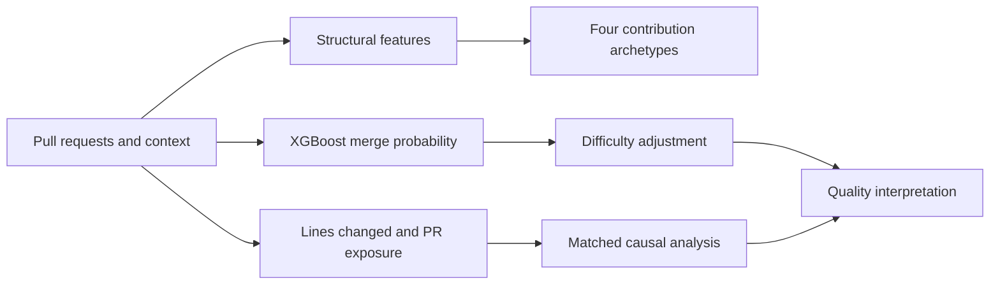

# Generative AI and the Quality of Public Contributions

**Predictive modeling · XGBoost · Model evaluation · Clustering · Causal inference**

I studied how generative AI changes the substance and quality of public software contributions. I combined causal analysis of pull-request activity with a machine-learning approach to account for differences in repository acceptance norms.

| Result | What it measures |
|---|---|
| **Approximately 48% fewer lines changed per pull request** | During Italy's ChatGPT suspension, conditional on submitting a pull request |
| **0.82 AUC versus 0.61 baseline** | XGBoost merge-probability discrimination versus a repository-level base rate |
| **Four contribution archetypes** | K-Means clusters of pull-request structural features |

The causal estimate and predictive-model evaluation answer different questions; AUC is not a causal effect or an accuracy percentage.

## The problem

More code does not necessarily mean better code. Likewise, whether a pull request is merged depends partly on the repository, its maintainers, and its acceptance norms. I separated contribution extent from acceptance-related quality and developed an adjustment for contextual difficulty.

## My contribution

I led the analysis from metric definition and feature engineering through predictive modeling, causal estimation, and interpretation. I developed an **XGBoost merge-probability model** using repository-, maintainer-, and contribution-level features, achieving **0.82 AUC compared with 0.61 for a repository-level base-rate baseline**. I used this model to develop a difficulty-adjusted quality metric and applied **K-Means to structural pull-request features**, identifying four major contribution archetypes.

I connected these measurements to the natural experiment to examine how AI access changes the substance of publicly attributable work. This project uses the same broader research data infrastructure as the related productivity and effort-allocation studies.

## How I approached it

1. **Represent the contribution.** Organize pull-request structure, repository characteristics, maintainer context, and observed acceptance outcomes.
2. **Separate volume from extent.** Measure total lines changed and pull-request frequency separately, then estimate expected lines changed per pull request through a count model with exposure.
3. **Model contextual acceptance.** Train XGBoost to estimate merge probability from contextual and contribution features and compare discrimination with a repository-level baseline.
4. **Adjust the quality measure.** Account for variation in acceptance difficulty rather than treating raw merge rates as directly comparable across repositories.
5. **Identify contribution patterns.** Use K-Means to summarize structural variation into four contribution archetypes.
6. **Estimate the effect of lost AI access.** Apply matched difference-in-differences using Italy as treatment and France and Portugal as comparison countries; examine extent and accuracy-related outcomes and differences by experience.

## Findings and why they matter

The manuscript reports approximately **48% fewer lines changed per pull request** during the suspension. This estimate is conditional on developer-weeks with positive pull-request activity; it does not mean 48% fewer pull requests or 48% lower total productivity.

The corresponding manuscript accuracy estimate increased approximately **1.1% during the suspension**, with marginal statistical significance at the 10% level. This is a much smaller movement than the change in extent, rather than evidence that accuracy is exactly unchanged. The effect on extent was similar across experience groups.

The predictive model's **0.82 AUC** demonstrates stronger ranking of merge outcomes than the **0.61 repository baseline**. Merge outcomes remain an imperfect quality proxy: acceptance also reflects project fit, maintainer decisions, and other context. Discrimination does not by itself establish calibration, correctness, or causal validity.

The contribution is to combine **behavioral measurement, contextual predictive modeling, and causal analysis** so that quantity and quality are assessed separately. This is transferable to Data Scientist problems where observed success rates depend on the difficulty of the cases being evaluated.

## Explore the work

| Sample | What it demonstrates |
|---|---|
| [Quality model](quality_model.py) | Representative XGBoost workflow, held-out evaluation, and a train-only repository baseline |
| [Contribution archetypes](contribution_archetypes.py) | Scaling structural features and fitting four K-Means clusters |
| [Exposure specification](extent_model.py) | Correct separation of total lines, pull-request exposure, and conditional sample |
| [Methodology](methodology.md) | Predictive versus causal claims and interpretation of quality proxies |

**Underlying study:** *Generative AI and Public Knowledge Work.*

## About the code

This is a curated research showcase. The Python files are condensed, refactored examples of selected workflows, with representative reconstructions where the full proprietary implementation is not included. They are designed for code review, not as a runnable replication package. Research results below describe the completed studies; the samples do not reproduce those estimates.

The confidential dataset, original collection archive, credentials, and proprietary production code are not distributed. See [sample provenance and scope](code-notes.md).

## Research and contact

**Sardar Fatooreh Bonabi** · Data Science · University of California, Irvine  
[GitHub](https://github.com/SardarBonabi/) · [LinkedIn](https://www.linkedin.com/in/sardarb/)

This portfolio presents my contributions to collaborative doctoral research. Manuscript titles identify the underlying studies; no journal acceptance or publication status is implied.
