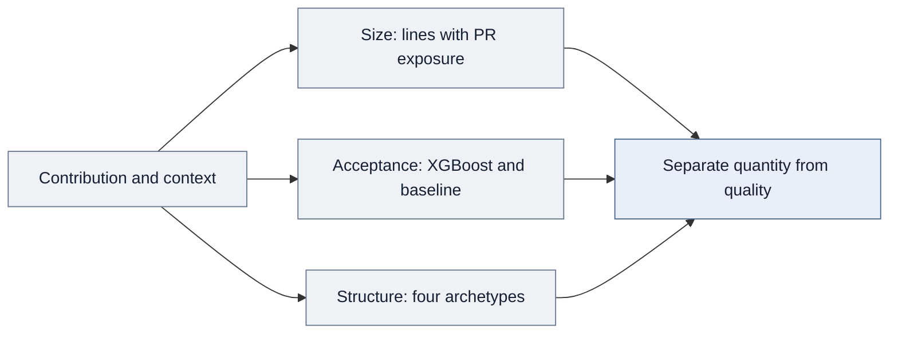

<div align="center">

# Are AI Users Producing More Work—or Better Work?

Separating output volume from contribution quality when evaluating an AI tool.

**Product evaluation · XGBoost · Baseline comparison · Causal inference**

[Decision](#the-product-decision) · [Results](#results-and-interpretation) · [Approach](#analytical-approach) · [Code](#explore-the-implementation)

</div>

## The product decision

**How should a team evaluate an AI tool when more output does not necessarily mean better outcomes?**

A developer product can increase the amount of code users submit without improving its usefulness. Acceptance rates add another signal, but they also reflect repository expectations and maintainer decisions. Comparing raw rates across different contexts can misrepresent performance.

I separated the amount of work per contribution from acceptance-related quality. I combined causal analysis of an interruption in ChatGPT access with predictive modeling of merge outcomes to account for differences in contribution context.

## Results and interpretation

<table>
<tr><th align="left">Contribution size</th><th align="left">Predictive discrimination</th><th align="left">Behavioral segmentation</th></tr>
<tr>
<td valign="top"><h2>~48% lower</h2>Lines changed per pull request during lost access<br><sub>Conditional on positive pull-request activity</sub></td>
<td valign="top"><h2>0.82 AUC</h2>XGBoost versus 0.61 repository baseline<br><sub>Ranking merge outcomes</sub></td>
<td valign="top"><h2>4 groups</h2>Structural contribution archetypes<br><sub>K-Means segmentation</sub></td>
</tr>
</table>

**The key distinction:** the causal estimate measures a response to changed access; AUC measures predictive ranking. They answer different questions and should not be combined into a single product-impact claim.

The manuscript's accuracy-related measure increased approximately **1.1% during the suspension**, with marginal statistical significance at the 10% level. That small movement is not proof that quality was unchanged. The effect on contribution size was similar across experience groups.

## How this would inform a product evaluation

| Decision | Application of the analysis | What is still needed |
|---|---|---|
| Choose success metrics | Track contribution size and quality-related outcomes separately | Direct measures of correctness, usefulness, and downstream user value |
| Compare performance across contexts | Account for repository and maintainer differences before interpreting acceptance rates | Validation of the adjustment for the target population |
| Evaluate a prediction model | Compare against a meaningful baseline, not only a standalone score | Calibration and decision-specific costs before using probabilities operationally |
| Understand behavioral changes | Examine contribution types as well as overall averages | Validation that segments remain useful in the intended product setting |

These are proposed applications. The work does not establish a production deployment, automated acceptance policy, or a commercial ROI result.

## Analytical approach

### 1. Separate activity volume, contribution size, and quality

| Measurement | What it answers | What it does not establish |
|---|---|---|
| Pull-request count | How often users contribute | How substantial or useful the contributions are |
| Lines changed per pull request | How large contributions are | Correctness or value of the code |
| Merge outcome | Whether work was accepted in its context | A direct, context-free test of quality |
| Difficulty-adjusted quality metric | How to account for contextual acceptance difficulty | That all remaining differences are intrinsic quality |

I organized repository-, maintainer-, and contribution-level features and developed an **XGBoost merge-probability model**. It achieved **0.82 AUC versus 0.61 for a repository-level base-rate baseline**. AUC reflects discrimination, not classification accuracy or calibrated probabilities.

### 2. Account for context in quality measurement

I used the predictive model to develop a difficulty-adjusted quality metric. The objective was to avoid treating raw merge rates as directly comparable when acceptance conditions differ.

<details>
<summary><strong>Predictive evaluation and public sample boundaries</strong></summary>

The public example demonstrates a baseline computed on training data and an explicitly supplied holdout. These are representative engineering choices. The original split design, hyperparameters, calibration results, and exact adjustment formula are not included in this release.

The displayed residual of observed acceptance minus predicted acceptance is an illustrative adjustment, not the proprietary research formula. The repository does not claim that this residual generated the manuscript's accuracy estimate. Calibration would need to be assessed before interpreting predicted probabilities as an operational adjustment.

</details>

### 3. Estimate the response to changed AI access

I applied **matched difference-in-differences**, using Italy's temporary ChatGPT suspension and developers in France and Portugal as comparisons. For contribution size, the **Poisson pseudo-maximum-likelihood model** uses total lines changed as the outcome and pull-request count as exposure.

```text
E[total_lines_it | X] = PR_count_it × exp(
    developer_effect_i + week_effect_t + treatment_terms_it + controls_it
)
```

The log of positive pull-request count enters as an offset with coefficient fixed to one. The reported incidence-rate ratio of **0.522** corresponds to approximately 48% fewer expected lines per pull request. This is conditional on developer-weeks with positive PR activity; it is not 48% fewer pull requests or 48% lower overall productivity. A count model with exposure is also different from ordinary least squares on a precomputed ratio.

### 4. Describe the types of contributions users make

I applied **K-Means to structural pull-request features**, identifying four contribution archetypes. This adds a behavioral view to the size and acceptance measures. The representative sample illustrates transformation, scaling, and clustering; empirical cluster names and proprietary feature settings are not reconstructed.



## What I owned and delivered

I led metric definition, feature engineering, predictive modeling, baseline comparison, difficulty adjustment, segmentation, causal estimation, and interpretation. The project uses the shared developer-activity infrastructure supporting the related productivity and engagement analyses.

The deliverable is a framework for evaluating **output and quality separately while accounting for context**. Its strongest practical lesson is to define what “better” means before interpreting a larger activity metric or a stronger model score as product success.

The access interruption is a specific setting, individual AI use is not directly observed, and merge outcomes remain an imperfect quality proxy. These boundaries matter when transferring the findings to another product or user population.

## Explore the implementation

> **Research status and code availability:** The research is currently under review. The full research code and data are proprietary and are not distributed here. The public code consists only of selected, simplified samples of the general workflow; it is not the complete research implementation or a replication package.

| Sample | What to inspect |
|---|---|
| [Quality model](quality_model.py) | Representative XGBoost workflow, holdout, and training-only baseline |
| [Contribution archetypes](contribution_archetypes.py) | Structural features, scaling, and four-cluster fitting |
| [Exposure specification](extent_model.py) | Total lines, PR exposure, and conditional sample |
| [Methodology](methodology.md) | Predictive evaluation, causal claims, and quality interpretation |

<details>
<summary><strong>Research source and sample scope</strong></summary>

This case study presents my contributions to collaborative doctoral research at UC Irvine, framed around the product decisions the analysis can inform. The underlying study is *Generative AI and Public Knowledge Work*. Product applications described here are proposed uses of the evidence, not claims of a commercial deployment or a tested product rollout.

Public files include selected refactored examples and representative reconstructions. They do not reproduce the research estimates. See [code provenance and scope](code-notes.md).

</details>

---

**Sardar Fatooreh Bonabi** · Data Science · University of California, Irvine  
[GitHub](https://github.com/SardarBonabi/) · [LinkedIn](https://www.linkedin.com/in/sardarb/)
